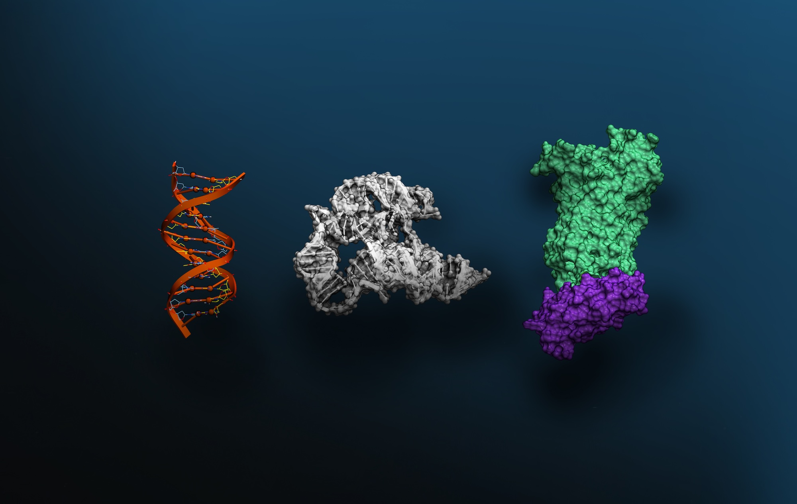

# NVIDIA BioNeMo Agent Toolkit

**Turn any agent into a life science expert with NVIDIA BioNeMo skills.**

Protein folding, molecular docking, generative chemistry, genomics analysis,
protein design, and biomarker discovery — a decade of NVIDIA life sciences
libraries, tools, and models, packaged as ready-to-call agent skills.

Each skill gives a coding or scientific agent structured instructions, scripts,
and references to select a tool, prepare inputs, run it, inspect outputs, and
explain results — across both single tasks and multi-step scientific workflows.

## Install
Skills install with the [`skills` CLI](https://github.com/vercel-labs/skills):

```bash
# interactive — pick a skill + install destination
npx skills add NVIDIA-BioNeMo/bionemo-agent-toolkit

# one skill, no prompts
npx skills add NVIDIA-BioNeMo/bionemo-agent-toolkit --skill boltz2-nim --yes

# target a specific agent (repeatable)
npx skills add NVIDIA-BioNeMo/bionemo-agent-toolkit --skill boltz2-nim --agent claude-code
npx skills add NVIDIA-BioNeMo/bionemo-agent-toolkit --skill boltz2-nim --agent codex

# browse the catalog without installing
npx skills add NVIDIA-BioNeMo/bionemo-agent-toolkit --list
```

The repo also ships self-hosted plugin marketplaces:
 - **Codex:** [.agents/plugins/marketplace.json](.agents/plugins/marketplace.json)
 - **Claude Code:** [.claude-plugin/marketplace.json](.claude-plugin/marketplace.json)
so the `bionemo-agent-toolkit` plugin installs through each agent's native plugin
flow as well. Skills are also discoverable by partner harnesses directly from the repo.

## Skill Catalog

| Product | Description | Skills |
|---------|-------------|--------|
| **Protein Binder Design** | End-to-end de novo binder design workflows — a NIM route and a Proteina-Complexa route. | [`protein-binder-design`](workflows/generative_protein_binder_design/protein-binder-design), [`complexa-binder-design`](workflows/generative_protein_binder_design/complexa-binder-design) |
| **Boltz-2** | Biomolecular structure prediction + binding affinity (NIM). | [`boltz2-nim`](nim-skills/boltz2-nim) |
| **DiffDock** | Small-molecule docking and binding-pose prediction (NIM). | [`diffdock-nim`](nim-skills/diffdock-nim) |
| **Evo 2** | DNA sequence generation and variant scoring (NIM). | [`evo2-nim`](nim-skills/evo2-nim) |
| **GenMol** | De novo molecule generation, scaffold decoration, lead optimization (NIM). | [`genmol-nim`](nim-skills/genmol-nim) |
| **MolMIM** | Latent-space small-molecule generation and optimization (NIM). | [`molmim-nim`](nim-skills/molmim-nim) |
| **MSA-Search** | Multiple sequence alignments via ColabFold (NIM). | [`msa-search-nim`](nim-skills/msa-search-nim) |
| **OpenFold2** | Monomer protein structure prediction (NIM). | [`openfold2-nim`](nim-skills/openfold2-nim) |
| **OpenFold3** | Biomolecular complex structure prediction (NIM). | [`openfold3-nim`](nim-skills/openfold3-nim) |
| **ProteinMPNN** | Inverse folding / sequence design for a target backbone (NIM). | [`proteinmpnn-nim`](nim-skills/proteinmpnn-nim) |
| **RFdiffusion** | De novo protein backbone and binder design (NIM). | [`rfdiffusion-nim`](nim-skills/rfdiffusion-nim) |
| **Generative Virtual Screening workflow** | Generate candidate molecules, dock them to a target, and score binding affinity (GenMol → DiffDock → Boltz-2). | [`drug-discovery-pipeline`](nim-skills/meta-skills/drug-discovery-pipeline) |
| **MSA-enabled protein structure prediction workflow** | Build a multiple sequence alignment, then predict structure (MSA-Search → OpenFold3). | [`msa-structure-prediction-pipeline`](nim-skills/meta-skills/msa-structure-prediction-pipeline) |
| **Proteina-Complexa** | Co-design of protein binder sequence + structure with reward-guided test-time search (open model). | [`complexa-setup`](open-models-skills/proteina-complexa/complexa-setup), [`complexa-target`](open-models-skills/proteina-complexa/complexa-target), [`complexa-design`](open-models-skills/proteina-complexa/complexa-design), [`complexa-sweep`](open-models-skills/proteina-complexa/complexa-sweep), [`complexa-evaluate-pdbs`](open-models-skills/proteina-complexa/complexa-evaluate-pdbs), [`complexa-slurm`](open-models-skills/proteina-complexa/complexa-slurm) |
| **KERMT** | GROVER/cMIM molecular encoder for embeddings, property prediction, and ADMET (open model). | [`kermt-setup`](open-models-skills/kermt/skills/kermt-setup), [`kermt-infer`](open-models-skills/kermt/skills/kermt-infer), [`kermt-embed`](open-models-skills/kermt/skills/kermt-embed), [`kermt-finetune`](open-models-skills/kermt/skills/kermt-finetune), [`kermt-continue-pretrain`](open-models-skills/kermt/skills/kermt-continue-pretrain), [`kermt-pretrain-scratch`](open-models-skills/kermt/skills/kermt-pretrain-scratch), [`kermt-add-cmim-pretrain`](open-models-skills/kermt/skills/kermt-add-cmim-pretrain), [`kermt-monitor`](open-models-skills/kermt/skills/kermt-monitor) |
| **Parabricks** | Agent-ready skills built on Parabricks for accelerated genomic analysis and workflows. | [`parabricks`](library-skills/parabricks), [`genomics-workflow-acceleration`](library-skills/genomics-workflow-acceleration) |
| **nvMolKit** | GPU-accelerated, RDKit-style cheminformatics (fingerprints, similarity, conformers). | [`nvmolkit-usage`](library-skills/nvMolKit) |
| **cuEquivariance** | Build equivariant neural-network primitives (segmented tensor products, CG coefficients). | [`cuequivariance`](library-skills/cuEquivariance) |

Every skill is a directory with a `SKILL.md` (YAML frontmatter + instructions),
optional `references/`, and optional `scripts/`. The generated, installable plugin
lives in [`plugins/bionemo-agent-toolkit/`](plugins/bionemo-agent-toolkit).

## License

This project is dual-licensed:

- **Source code** (scripts, tests, build tooling): [Apache-2.0](LICENSE-APACHE-2.0)
- **Skills and documentation** (SKILL.md, workflows, READMEs): [CC-BY-4.0](LICENSE-CC-BY-4.0)

See [LICENSE](LICENSE) for the full dual-license statement. Individual skills may reference third-party
data sources with their own terms; consult each skill's references and the [NOTICE](NOTICE) file.
